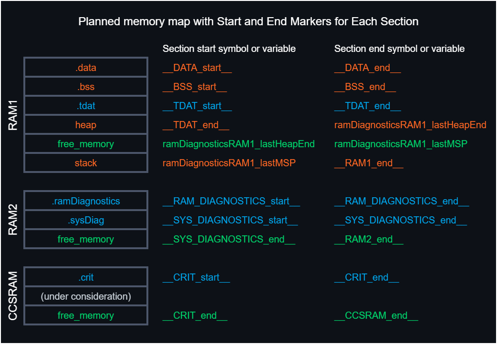

TrinityTrack6000 is a custom-built, multi-MCU remote-controlled tank constructed from 2 mm and 3 mm steel sheets. The system runs on a custom PCB integrating STM32, Infineon, and AVR microcontrollers, designed from scratch with fully deterministic memory allocation and task management.

The project leverages **ThreadX RTOS** on the STM32 for high-level coordination and **Micrium µC/OS RTOS** on the Infineon MCU for precise motor and servo control. The AVR MCU functions as an I²C slave for reading data from 1-Wire temperature sensors, allowing time-critical acquisition without blocking main task execution.

All tasks on STM32 and Infineon MCUs are allocated with **guard zones** in RAM, using custom **linker scripts** to arrange task stacks and guard areas contiguously. This setup enables continuous memory monitoring and deterministic stack overflow detection, fully compatible with static memory allocation principles.

The project is developed according to **MISRA C:2025** standards, ensuring safe, maintainable, and portable code. The system includes robust diagnostics and fault-handling mechanisms, including monitoring of RAM and CPU usage, task stack overflows, and EEPROM-based error logging.

Powering the tank is a **custom-designed switching power supply**, built from scratch to provide stable and reliable voltage for all MCUs and high-current peripherals.

> 🔧 Status: Planned after finishing DrinkCreator6000  
> 🧪 Goal: Serve as a futuristic, educational platform for learning **STM32**, **Infineon MCUs**, and real-time operating systems **ThreadX** and **Micrium µC/OS**, while exploring multi-MCU coordination and embedded system design  

---

## ✳️ Planned Technologies & Tools

**TrinityTrack6000** is an advanced embedded system project that combines hardware, software, and system-level design principles typically seen in professional-grade applications. The project is focused on precise tracking and control, integrating multiple peripherals and sensors to achieve robust and reliable performance.

## Development Strategy

- **Prototyping Phase:** The initial development and testing are conducted on a **Nucleo board with STM32L476RGT6**, using **STM32 HAL** for rapid prototyping and feature verification. This allows fast iteration and hardware abstraction during the early stages of the project.
- **Production Phase:** The final implementation will be migrated to a **custom PCB featuring STM32G473CET6**, developed using **bare-metal / LL (Low-Layer) drivers**. This phase focuses on performance optimization, resource efficiency, and full control over hardware-level operations.

## Key Features

- Modular hardware and software architecture
- Integration of multiple sensors and communication interfaces
- Scalable design for both prototyping and production
- Hybrid approach: HAL for fast development, LL/bare-metal for final product optimization
### 🔌 Hardware & Electronics
- **Nucleo STM-64 STM32L4RGT6 board** for rapid prototyping and learning STM32
- Custom PCB hosting all MCUs:
  - **STM32G473CET6 MCU** – Handles high-level coordination tasks and system management
  - **Infineon MCU** – Controls precise motor and servo operations with real-time current monitoring
  - **ATmega AVR MCU** as I²C Slave – Reads data from 1-Wire temperature sensors
- **nRF24l01** module
- **ADXL345** module
- **EEPROM** IC for storing data and settings for MCUs between bootups (Yet to be selected)
- Separate custom switching power supply PCB – Provides stable voltage rails for all MCUs and high-current peripherals

### 🧠 System Architecture & Concepts
- Real-time system based on **ThreadX** (STM32) and **Micrium µC/OS** (Infineon)
- Static memory allocation only — no malloc, no heap fragmentation
- Custom linker scripts with dedicated memory sections for task stacks and **guard zones**
- Preemptive multitasking with structured task separation
- Guard zone-based stack overflow detection for all tasks
- EEPROM-based error logging and system state preservation
- Fault recovery logic with planned automatic restart on critical errors

### 💬 Input / Output Interfaces
- UART serial interface for remote monitoring, control, and debugging
- I²C bus for AVR slave communication and peripheral integration
- Multi-level diagnostic LCD menu (planned) for viewing system status and sensor data
- Wireless interface: nRF24L01 for remote control and telemetry

### 🧰 Development Tools & Libraries
- **C / C++** for firmware development
- Native MCU libraries with low-level register access
- **ThreadX** for STM32, **Micrium µC/OS** for Infineon
- **VS Code, CMake, Ninja** for building and managing the project
- **Doxygen** for automatic code documentation

### 📚 Documentation
The source code is fully documented using **Doxygen**, which generates up-to-date, browsable documentation from the annotated source files. The generated docs can be found in the `docs/` directory and are updated as part of the build process.

---

## 🧠 Design Goals

- 💾 Use 100% static memory allocation (no malloc, no heap)
- 🧰 Track system stability via runtime task/memory debug tools, including guard zones and stack overflow detection
- 🔁 Ensure fault safety: robust recovery after failure or communication loss using EEPROM fault logging
- 📟 Provide full system visibility through LCD diagnostics and monitoring
- 🧪 Serve as a practical educational platform for learning **STM32** and **Infineon MCUs**, as well as real-time operating systems **ThreadX** and **Micrium µC/OS**
- 📚 Deepen understanding of multitasking, resource sharing, fail-safe system design, and embedded system best practices
- 🧩 Implement low-level memory management techniques for optimized and reliable resource control
- 🧱 Integrate tightly with custom hardware (PCB, sensors, actuators, display)
- 🌐 Explore principles of distributed embedded systems and multi-MCU communication commonly used in commercial applications
- 🚀 Benchmark RAM bank variable placement and assembly-level optimizations to maximize performance
- ⚡ Benchmark FPU/ALU instruction interleaving using manual ASM scheduling to explore cycle-level parallelism
  
---

## 🗺️ Prototyping Roadmap  

- ✅ Migrate project to VS Code, CMake, and Ninja build system with the `arm-gcc` toolchain and HAL files generated by STM32CubeIDE
- ✅ Fix the **Core blocked** issue after uploading the `.elf` file generated by CMake
- ✅ Verify `.elf` and `.map` builds with debug symbols for flashing and debugging
- ✅ Modify the CMake configuration to support selecting either **Debug** or **Release** build types
- ✅ Modify linker script to add extra symbols and sections for using alternative RAM banks (RAM2, CCMRAM) and diagnostics
- 🔄 Implement initialization functions to initialize STM32
- 🔄✅ Implement a diagnostic function to display RAM usage over UART, including `.bss`, `.data`, `.heap`, `.stack`, and other linker sections such as `.tdat`
- 🔄 Integrate ThreadX RTOS: add CMake build configuration, system setup, memory layout adjustments, and initial task scheduling

## 🗺️ Production Roadmap

- 🔄 Migrate project to VS Code, CMake, and Ninja build system with the `arm-gcc` toolchain and HAL files generated by STM32CubeIDE with support of **Debug** and **Release** build types
- 🔄 Verify `.elf` and `.map` builds with debug symbols for flashing and debugging

---

## Technical Table of Contents

1. [Project Structure & File Overview](#1--project-structure--file-overview)
2. [Design considerations](#2-systems-architecture)
3. [MCU's pinouts](#3-mcus-pinouts)
   - [3.1 STM32G473CET6 Pinout (LQFP-48)](#31-stm32g473cet6-pinout-lqfp-48)
   - [3.2 Infineon Pinout](#32-infineon-pinout)
   - [3.3 ATmega328p Pinout](#33-atmega328p-pinout-tqfp-32)
4. [System's architecture](#4-systems-architecture)
---

## ⚙️ Technical Overview STM32 Part

## 1. 📦 Project Structure & File Overview

    📦 TrinityTrack6000/
 	│
   	├── .git
	├── AVR/                     # ATmega328p MCU files
 	├── Datasheets/              # Documentation of used ICs and components
	├── docs/                    # Documentation generated by Doxygen for each MCU's files
	│
	├── Infineon/                # Infineon MCU files
	|
  	├── Media/                   # Folder containing all the drawings and schematics
    |
 	├── STM32/                   # STM32 MCU's files
    │   ├── .metadata/           # STM32CubeIDE workspace files folder
	│   ├── STM32L476RGT6/       # STM32 prototyping files
 	│   │   ├── .settings/
   	│   │   ├── .vscode/         # Visual Studio Code configuration files
   	│   │   ├── build/           # Build output directory (generated by CMake + Ninja)
	│   │   ├── Core/
  	│   │   ├── Drivers/
   	│   │   ├── Include/         # Project include files
	│   │   ├── Init/            # Initialization includes and sources
    │   │   ├── Src/             # Project source files
	│   │   ├── Utils/           # Helper functions
 	│   │   ├── .cproject
  	│   │   ├── .mxproject
   	│   │   ├── .project
	│   │   ├── CMakeLists.txt  # CMake build system configuration for STM32L476RGT6
  	│   │   ├── STM32L476RGT6 Debug.launch
    │   │   ├── STM32L476RGT6.ioc
	│   │   └── STM32L476RGTX_FLASH.ld # Linker script with custom memory sections
	│   │
	│   ├── STM32G473CET6       # STM32 target MCU production files
	│   └── ... (other files)   # Yet to be added after prototyping phase
    |
	├── tools/                  # Helper tools
	│   ├── avr8-gnu-toolchain-win32_x86_64/                                     # avr-gcc toolchain
 	│   ├── arm-gnu-toolchain-14.3.rel1-mingw-w64-x86_64-arm-none-eabi/          # arm-gcc toolchain
    │   └── AVRDUDE             # Yet to be added                                   
    |
 	├── .gitignore            # Git ignore configuration
	├── LICENSE               # Project license file
	└── README.md             # Project overview and documentation

---

## 2. Design considerations

### 2.1 SPI Max frequency vs line length and type

| Line type | Length [cm] | Frequency min [MHz] | Frequency max [MHz] | Single bit period [ns/bit] |
|-----------|-------------|---------------------|---------------------|----------------------------|
| PCB trace | 15          | 20                  | 25                  | 50                         |

---

## 3. MCU's pinouts

### 3.1 STM32G473CET6 Pinout (LQFP-48)

| Pin / Function | Usage |
|----------------|-------|
| PA0  ADC1_IN0 / TIM2_CH1 / USART2_RX / I2C1_SDA | ⚪ Unused |
| PA1  ADC1_IN1 / TIM2_CH2 / USART2_TX / I2C1_SCL | ⚪ Unused |
| PA2  ADC1_IN2 / TIM2_CH3 / USART2_CK / I2C1_SDA | ⚪ Unused |
| PA3  ADC1_IN3 / TIM2_CH4 / USART2_RTS / I2C1_SCL | ⚪ Unused |
| PA4  ADC1_IN4 / TIM3_CH1 / USART2_CTS / I2C1_SDA | ⚪ Unused |
| PA5  ADC1_IN5 / TIM3_CH2 / SPI1_SCK / I2C1_SCL | ⚪ Unused |
| PA6  ADC1_IN6 / TIM3_CH3 / SPI1_MISO / I2C1_SDA | ⚪ Unused |
| PA7  ADC1_IN7 / TIM3_CH4 / SPI1_MOSI / I2C1_SCL | ⚪ Unused |
| PA8  MCO / USART1_CK / I2C1_SDA | ⚪ Unused |
| PA9  USART1_TX / I2C1_SCL | ⚪ Unused |
| PA10 USART1_RX / I2C1_SDA | ⚪ Unused |
| PA11 USART1_RTS / I2C1_SCL | ⚪ Unused |
| PA12 USART1_CTS / I2C1_SDA | ⚪ Unused |
| PA13 SWDIO | ⚪ Unused |
| PA14 SWCLK | ⚪ Unused |
| PA15 JTDI / SPI1_NSS | ⚪ Unused |
| PB0  ADC2_IN8 / TIM3_CH1 / SPI2_NSS | ⚪ Unused |
| PB1  ADC2_IN9 / TIM3_CH2 / SPI2_SCK | ⚪ Unused |
| PB2  ADC2_IN10 / TIM3_CH3 / SPI2_MISO | ⚪ Unused |
| PB3  ADC2_IN11 / TIM3_CH4 / SPI2_MOSI | ⚪ Unused |
| PB4  ADC2_IN12 / TIM4_CH1 / SPI2_NSS | ⚪ Unused |
| PB5  ADC2_IN13 / TIM4_CH2 / SPI2_SCK | ⚪ Unused |
| PB6  ADC2_IN14 / TIM4_CH3 / SPI2_MISO | ⚪ Unused |
| PB7  ADC2_IN15 / TIM4_CH4 / SPI2_MOSI | ⚪ Unused |
| PB8  I2C2_SCL / USART3_TX | ⚪ Unused |
| PB9  I2C2_SDA / USART3_RX | ⚪ Unused |
| PB10 I2C2_SCL / USART3_CK | ⚪ Unused |
| PB11 I2C2_SDA / USART3_RTS | ⚪ Unused |
| PB12 I2C2_SCL / USART3_CTS | ⚪ Unused |
| PB13 JTMS / SWDIO | ⚪ Unused |
| PB14 JTCK / SWCLK | ⚪ Unused |
| PB15 JTDI / SPI1_NSS | ⚪ Unused |
| PC13 TAMPER / RTC_IN | ⚪ Unused |
| PC14 OSC32_IN | ⚪ Unused |
| PC15 OSC32_OUT | ⚪ Unused |
| PD0  ADC4_IN0 / TIM4_CH1 / USART2_RX | ⚪ Unused |
| PD1  ADC4_IN1 / TIM4_CH2 / USART2_TX | ⚪ Unused |
| PD2  ADC4_IN2 / TIM4_CH3 / USART2_CK | ⚪ Unused |
| PD3  ADC4_IN3 / TIM4_CH4 / USART2_RTS | ⚪ Unused |
| PD4  ADC4_IN4 / TIM5_CH1 / USART2_CTS | ⚪ Unused |
| PD5  ADC4_IN5 / TIM5_CH2 / USART2_RX | ⚪ Unused |
| PD6  ADC4_IN6 / TIM5_CH3 / USART2_TX | ⚪ Unused |
| PD7  ADC4_IN7 / TIM5_CH4 / USART2_CK | ⚪ Unused |

### 3.2 Infineon Pinout

(soon)

## 3.3 ATmega2561 Pinout (TQFP-32)

| Pin | Usage |
|-----|-------|
| PC6 (RESET/PCINT14)     | ⚪ Unused |
| PD0 (RXD/PCINT16)       | ⚪ Unused |
| PD1 (TXD/PCINT17)       | ⚪ Unused |
| PD2 (INT0/PCINT18)      | ⚪ Unused |
| PD3 (INT1/OC2B/PCINT19) | ⚪ Unused |
| PD4 (T0/XCK/PCINT20)    | ⚪ Unused |
| VCC                     | ⚪ Power |
| GND                     | ⚪ Ground |
| PB6 (XTAL1/TOSC1/PCINT6)| ⚪ Crystal |
| PB7 (XTAL2/TOSC2/PCINT7)| ⚪ Crystal |
| PD5 (T1/OC0B/PCINT21)   | ⚪ Unused |
| PD6 (AIN0/OC0A/PCINT22) | ⚪ Unused |
| PD7 (AIN1/PCINT23)      | ⚪ Unused |
| PB0 (ICP1/CLKO/PCINT0)  | ⚪ Unused |
| PB1 (OC1A/PCINT1)       | ⚪ Unused |
| PB2 (SS/OC1B/PCINT2)    | ⚪ Unused |
| PB3 (MOSI/OC2A/PCINT3)  | ⚪ Unused |
| PB4 (MISO/PCINT4)       | ⚪ Unused |
| PB5 (SCK/PCINT5)        | ⚪ Unused |
| AVCC                    | ⚪ Power |
| ADC6                    | ⚪ Unused |
| AREF                    | ⚪ Reference |
| GND                     | ⚪ Ground |
| PC0 (ADC0/PCINT8)       | ⚪ Unused |
| PC1 (ADC1/PCINT9)       | ⚪ Unused |
| PC2 (ADC2/PCINT10)      | ⚪ Unused |
| PC3 (ADC3/PCINT11)      | ⚪ Unused |
| PC4 (ADC4/SDA/PCINT12)  | ⚪ Unused |
| PC5 (ADC5/SCL/PCINT13)  | ⚪ Unused |
| ADC7                    | ⚪ Unused |

---

## 4. System's architecture

---

## 5. STM32G473CET6

### 5.7. 💾 Memory Layout

#### 5.7.1 RAM Map

- `__data_start` is a linker symbol representing the starting address of the `.data` section in SRAM on AVR microcontrollers.
- `__data_end` is a linker symbol representing the ending address of the `.data` section in SRAM on AVR microcontrollers.
- `__bss_start` is a linker symbol representing the starting address of the `.bss` section in SRAM on AVR microcontrollers.
- `__bss_end` is a linker symbol representing the ending address of the `.bss` section in SRAM on AVR microcontrollers.
- `__tdat_start` is a linker symbol representing the starting address of the `.tdat` section in SRAM.
- `__tdat_end` is a linker symbol representing the ending address of the `.tdat` section in SRAM.
- `__heap_start` is a linker symbol representing the starting address of the heap section in SRAM.
- `__heap_end` is a C variable defined by me to represent the current end of the heap. Its value is calculated at runtime (see Notes below).
- `__stack_ptr` is a C variable defined by me to capture the initial value of the stack pointer before the RTOS scheduler starts (see Notes below).
- `RAMEND` is a predefined constant representing the last address of SRAM on AVR microcontrollers. For the ATmega2561 used in this project, `RAMEND` is equal to `0x21FF`.

*Note:*
- The `.tdat` section is a custom memory segment defined in the linker script. It is used to store Task Control Blocks (TCBs), task stacks, and associated guard zones. By placing all task stacks contiguously within .tdat, the system ensures controlled stack allocation and simplifies stack overflow detection.
- The symbols `__tdat_start` and `__tdat_end` were predefined in the linker script, along with a custom `.tdat` section. This section is used to store Task Control Blocks (TCBs), task stacks, and corresponding guard zones. The `.tdat` section ensures that stacks and their guard zones are placed contiguously in memory, enabling reliable stack overflow monitoring.
- The `__heap_end` variable is computed as:
  
      __heap_end = (__brkval != 0) ? __brkval : (void*)&__heap_start;
  
- `__brkval` is a pointer internally managed by malloc() to indicate the current top of the heap. If no memory has been allocated yet, it remains zero.
- The `__stack_ptr` variable is initialized with the value of the `SP` register before the RTOS scheduler starts. On AVR microcontrollers, `SP` holds the current stack pointer. However, after the scheduler starts, `SP` is overwritten with the stack pointer of the currently executing task, which would lead to incorrect free memory calculations if used directly.

#### 5.7.2 Custom RAM Segments

## 6. Infineon

---

## 7. ATmega2561

---

### X. Pinout overview

#### X.1 Required signals list STM32

USART_RX
USART_TX

SPI1_MOSI
SPI1_MISO
SPI1_SCK

SPIn_MOSI
SPIn_MISO
SPIn_SCK

CS_NRF24L01
CS_STM32
CS_EEPROM
CS_INFINEON

SPI1_REQ
SPI1_BUSY

I2Cn_SDA
I2Cn_SCL

SWDIO
SWDCLK
NRST
SWO

D+
D-

SMOKE_ON
LED_LIGHTS
CHASSIS_FANS
GUN_LOCK
POWER_LED_ON
BUZZER_DIAG
LED_ARMED
LED_UNARMED
LED_GUN_READY
INFINEON_KILL_SWITCH

AVR_RESTART
INFINEON_RESTART

