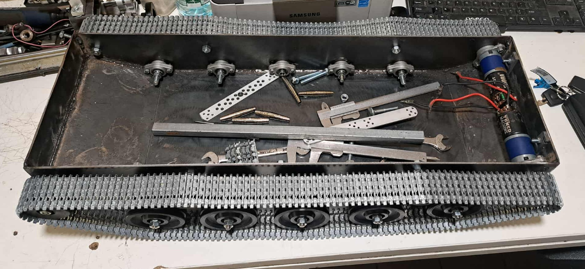
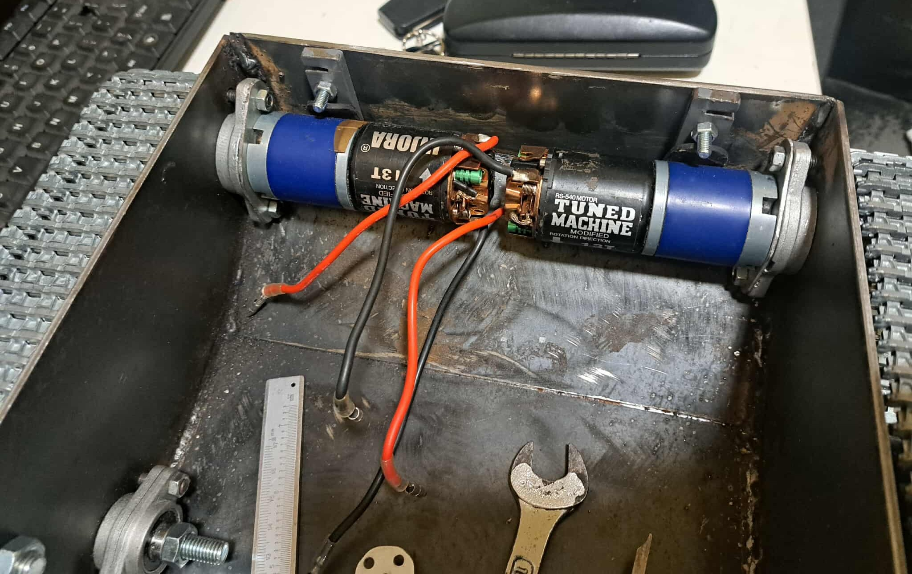

# TrinityTrack6000

**TrinityTrack6000** is a physically built, custom, multi-MCU remote-controlled tank, constructed from 2 mm and 3 mm steel sheets. It features a suspension system and a movable turret equipped with a BB‑pellet pistol for non-lethal target practice and sensor payload mounting. The project emphasizes a modular hardware approach: each functionality is implemented on a dedicated PCB module, enabling easy system expansion, parallel development of hardware and firmware, and straightforward integration of new features. This platform combines real-world mechanical construction with advanced electronics, serving both as a functional robotic vehicle and as an educational system for exploring embedded multi-MCU coordination, real-time control, and hardware integration.

The system consists of multiple PCBs based on STM32, Infineon, NXP, IXYS and FPGA microcontrollers, responsible for:

1. **ControlBoard** – **STM32 + Infineon**  
   - **STM32**: Main logic and system coordination, communication via radio and Bluetooth  
   - **Infineon**: Motor and servo control, current and temperature monitoring
2. **SensorHub** – **Sensor Interface Board**  
   - Handles integration of various sensors: temperature, acceleration, gas sensors (CO₂, O₂, ethanol, methane, butane), GPS, and others
3. **MotorInterfaceBoard** – **Motor & Servo Interface Board**  
   - Routes control signals to motors and servos; includes an H-bridge for motor control and handles power distribution and signal conditioning
4. **PowerControlBoard** – **Power Conversion Board**  
   - Converts battery voltage to the required voltages for all system boards; manages power distribution and protection
5. **VideoAudioBoard** – **FPGA**  
   - Handles audio and video capture, hardware compression (H.264/265), and transmission back to the operator
6. **FireControlBoard** – **NXP / IXYS (TBD)**  
   - Responsible for the fire control system using a laser rangefinder
7. **RadarBoard** – **NXP / IXYS (TBD)**  
   - Responsible for integration of a custom radar for object detection

The project serves as a learning platform for:

- Communication between multiple MCUs and real-time systems
- Understanding and working with different real-time operating systems
- Synchronization between MCUs and failsafe implementations
- FPGA programming and real-time video/audio processing
- Radar theory and object detection
- Power electronics (switch-mode power supplies) and H-bridge motor control

Given the project’s complexity, it is developed in stages, focusing on one PCB at a time. Each PCB has a dedicated README detailing system operation, component selection, program implementation or theory behind it.

---

## 🔧 Status - Planning phase and component selection for **ControlBoard** (STM32 + Infineon)

---

## 🧪 Project Goals
- Communication between multiple MCUs and real-time systems
- Synchronization between MCUs and failsafe implementations
- FPGA programming and real-time video/audio processing
- Radar theory and object detection
- Power electronics (switch-mode power supplies)
- Learning different real-time system architectures along with other industrial MCUs
- Practical implementation of H-bridge and motor control with current and temperature feedback
- Designing modular PCBs and integrating multiple MCUs within a single system

---

## ✳️ Planned Technologies & Tools

- **MCUs & Processors**: STM32, Infineon, NXP, IXYS, FPGA  
- **Sensor Modules**: Temperature, acceleration, gas sensors (CO₂, O₂, ethanol, methane, butane), GPS (TBD)  
- **Communication**: Radio modules, Bluetooth, Wi-Fi (TBD)  
- **Motor Control**: H-bridge, servo drivers, current and temperature monitoring  
- **Audio/Video**: FPGA-based capture, hardware compression (H.264/265), transmission  
- **Power Electronics**: Switch-mode power supplies, battery voltage conversion, power distribution  
- **Software / RTOS**: ThreadX, Micrium uC (TBD)  
- **Development Tools**: VS Code, CMake, Ninja, ARM-GCC toolchain  
- **PCB Design**: EasyEDA or Altium (TBD)  
- **Debugging & Monitoring**: Multimeter, oscilloscope

---

## 🛠️ Development Strategy

Each system board will be developed, prototyped, and tested sequentially, following the same design pipeline.  
The process for each board includes:

1. **Component Selection** – choosing appropriate components based on functionality, performance, and availability.  
2. **Schematic Design** – creating the circuit schematic and verifying signal flow.  
3. **Breadboard Testing & Firmware Development** – validating the concept on a breadboard while simultaneously developing and testing the firmware.  
4. **Electrical Design** – preparing detailed electrical connections and pin mapping for PCB integration.  
5. **PCB Design & Prototyping** – designing and manufacturing the first PCB version for testing.  
6. **Testing & Validation** – verifying correct operation, signal integrity, and communication between modules.  
7. **Iteration & Optimization** – refining both hardware and firmware based on test results.

*Note:*  
- In parallel, mechanical design and construction of the tank chassis, turret, and suspension are being developed alongside the electronics to ensure seamless integration between hardware and mechanics.

---

## 🌟 Key Features

- **Physically built prototype** — a fully custom-designed, steel-constructed tracked platform with an operational turret and BB gun.  
- **Modular electronic architecture** — each functional domain (control, power, sensors, video, etc.) is handled by a dedicated PCB, designed for scalability and ease of maintenance.  
- **Multi-MCU communication** — cooperative control between STM32, Infineon, FPGA, and other processors using various real-time communication interfaces.  
- **Real-time systems** — development and testing of different RTOS solutions, synchronization methods, and failsafe mechanisms.  
- **Advanced motor control** — H-bridge integration, servo signal routing, and feedback monitoring for current and temperature.  
- **High-performance video/audio processing** — FPGA-based real-time compression (H.264/265) and wireless transmission to the operator.  
- **Custom sensor integration** — environmental data collection (temperature, acceleration, gas concentration, GPS) for real-time feedback.  
- **Scalable power management** — modular power distribution with switch-mode power supplies and battery voltage conversion.  
- **Mechanical and electronic co-design** — parallel development of the chassis, suspension system, and electronic control boards.

---

## 🗺️ Project Roadmap

1. **ControlBoard** — Develop main logic and motor/servo interface, implement communication (radio/Bluetooth) and current/temperature monitoring.  
2. **SensorHub** — Integrate and validate all environmental sensors, GPS, and accelerometers.  
3. **Motor & Servo Interface Board** — Finalize H-bridge, signal routing, and power distribution for motors and servos.  
4. **PowerControlBoard** — Design and test battery voltage conversion and power distribution.  
5. **VideoAudioBoard** — Implement FPGA-based audio/video capture, compression, and wireless transmission.  
6. **FireControlBoard** — Develop fire control system using laser rangefinding.  
7. **RadarBoard** — Integrate and validate custom radar for object detection.

## 🖼️ Project Overview

**Physical Specifications:**

| Dimension            | Value        |
|----------------------|-------------|
| Length               | 70 cm       |
| Width (without tracks)| 32 cm       |
| Width (with tracks)  | 42 cm       |
| Height               | 20 cm       |
| Ground Clearance     | 5 cm        |
| Weight               | 25 kg       |

**Performance:**

- Maximum Speed: 5 km/h
- Features: Suspension system, rotating turret with BB gun

## ⚙️ Technical Overview 

### 1. 📦 Project Structure & File Overview

    📦 TrinityTrack6000/
 	 │
     ├── .git
 	 ├── Datasheets/              # Documentation of used ICs and components
	 ├── docs/                    # Documentation generated by Doxygen for each MCU's files
	 │
	 ├── MainControlBoard/                
	 ├── HardwareControlBoard/
     ├── PowerControlBoard/
     ├── SensorHubBoard/
     ├── RadarModuleBoard/
     ├── AVProcessingBoard/
     ├── FireControlBoard/
     ├── MechanicalDesign/
     |
  	 ├── Media/                   # Folder containing all the drawings and schematics
     |
	 ├── tools/                  # Helper tools
 	 │   └── arm-gnu-toolchain-14.3.rel1-mingw-w64-x86_64-arm-none-eabi/          # arm-gcc toolchain                         
     |
 	 ├── .gitignore            # Git ignore configuration
	 ├── LICENSE               # Project license file
	 └── README.md             # Project overview and documentation

---

### 2. Design considerations

#### 2.1 SPI Max frequency vs line length and type

| Line type         | Length [cm] | Frequency min [MHz] | Frequency max [MHz] | Single bit period [ns/bit] | Packet transfer time [μs] |
|-------------------|-------------|---------------------|--------------------|-----------------------------|---------------------------|
| PCB trace         | 15          | 20                  | 25                 | 50                          | 51.2                      |
| Unshielded wire   | 15          | 5                   | 10                 | 100                         | 102.4                     |
| Unshielded wire   | 30          | 2                   | 5                  | 200                         | 204.8                     |

*Note:* Packet size is 128 bytes (1024 bits).

---
