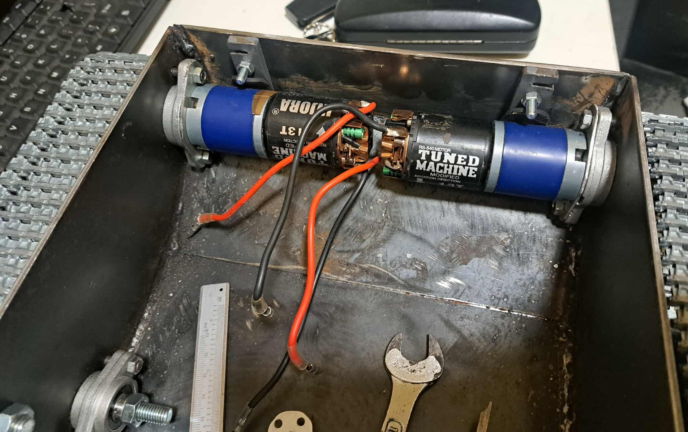

TrinityTrack6000 is a custom-built, multi-MCU remote-controlled tank constructed from 2 mm and 3 mm steel sheets. The system runs on a custom PCB integrating STM32, Infineon, and AVR microcontrollers, designed from scratch with fully deterministic memory allocation and task management.

The project leverages **ThreadX RTOS** on the STM32 for high-level coordination and **Micrium µC/OS RTOS** on the Infineon MCU for precise motor and servo control. The AVR MCU functions as an I²C slave for reading data from 1-Wire temperature sensors, allowing time-critical acquisition without blocking main task execution.

All tasks on STM32 and Infineon MCUs are allocated with **guard zones** in RAM, using custom **linker scripts** to arrange task stacks and guard areas contiguously. This setup enables continuous memory monitoring and deterministic stack overflow detection, fully compatible with static memory allocation principles.

The project is developed according to **MISRA C:2025** standards, ensuring safe, maintainable, and portable code. The system includes robust diagnostics and fault-handling mechanisms, including monitoring of RAM and CPU usage, task stack overflows, and EEPROM-based error logging.

Powering the tank is a **custom-designed switching power supply**, built from scratch to provide stable and reliable voltage for all MCUs and high-current peripherals.

> 🔧 Status: Planned after finishing DrinkCreator6000  
> 🧪 Goal: Serve as a futuristic, educational platform for learning **STM32**, **Infineon MCUs**, and real-time operating systems **ThreadX** and **Micrium µC/OS**, while exploring multi-MCU coordination and embedded system design  

---

## ✳️ Planned Technologies & Tools

**TrinityTrack6000** is an advanced embedded system project that combines hardware, software, and system-level design principles typically seen in professional-grade applications. The project is focused on precise tracking and control, integrating multiple peripherals and sensors to achieve robust and reliable performance.

## Development Strategy

- **Prototyping Phase:** The initial development and testing are conducted on a **Nucleo board with STM32L476RGT6**, using **STM32 HAL** for rapid prototyping and feature verification. This allows fast iteration and hardware abstraction during the early stages of the project.
- **Production Phase:** The final implementation will be migrated to a **custom PCB featuring STM32G473CET6**, developed using **bare-metal / LL (Low-Layer) drivers**. This phase focuses on performance optimization, resource efficiency, and full control over hardware-level operations.

## Key Features

- Modular hardware and software architecture
- Integration of multiple sensors and communication interfaces
- Scalable design for both prototyping and production
- Hybrid approach: HAL for fast development, LL/bare-metal for final product optimization
### 🔌 Hardware & Electronics
- **Nucleo STM-64 STM32L4RGT6 board** for rapid prototyping and learning STM32
- Custom PCB hosting all MCUs:
  - **STM32G473CET6 MCU** – Handles high-level coordination tasks and system management
  - **Infineon MCU** – Controls precise motor and servo operations with real-time current monitoring
  - **ATmega AVR MCU** as I²C Slave – Reads data from 1-Wire temperature sensors
- **nRF24l01** module
- **ADXL345** module
- **EEPROM** IC for storing data and settings for MCUs between bootups (Yet to be selected)
- Separate custom switching power supply PCB – Provides stable voltage rails for all MCUs and high-current peripherals

### 🧠 System Architecture & Concepts
- Real-time system based on **ThreadX** (STM32) and **Micrium µC/OS** (Infineon)
- Static memory allocation only — no malloc, no heap fragmentation
- Custom linker scripts with dedicated memory sections for task stacks and **guard zones**
- Preemptive multitasking with structured task separation
- Guard zone-based stack overflow detection for all tasks
- EEPROM-based error logging and system state preservation
- Fault recovery logic with planned automatic restart on critical errors

### 💬 Input / Output Interfaces
- UART serial interface for remote monitoring, control, and debugging
- I²C bus for AVR slave communication and peripheral integration
- Multi-level diagnostic LCD menu (planned) for viewing system status and sensor data
- Wireless interface: nRF24L01 for remote control and telemetry

### 🧰 Development Tools & Libraries
- **C / C++** for firmware development
- Native MCU libraries with low-level register access
- **ThreadX** for STM32, **Micrium µC/OS** for Infineon
- **VS Code, CMake, Ninja** for building and managing the project
- **Doxygen** for automatic code documentation

### 📚 Documentation
The source code is fully documented using **Doxygen**, which generates up-to-date, browsable documentation from the annotated source files. The generated docs can be found in the `docs/` directory and are updated as part of the build process.

---

## 🧠 Design Goals

- 💾 Use 100% static memory allocation (no malloc, no heap)
- 🧰 Track system stability via runtime task/memory debug tools, including guard zones and stack overflow detection
- 🔁 Ensure fault safety: robust recovery after failure or communication loss using EEPROM fault logging
- 📟 Provide full system visibility through LCD diagnostics and monitoring
- 🧪 Serve as a practical educational platform for learning **STM32** and **Infineon MCUs**, as well as real-time operating systems **ThreadX** and **Micrium µC/OS**
- 📚 Deepen understanding of multitasking, resource sharing, fail-safe system design, and embedded system best practices
- 🧩 Implement low-level memory management techniques for optimized and reliable resource control
- 🧱 Integrate tightly with custom hardware (PCB, sensors, actuators, display)
- 🌐 Explore principles of distributed embedded systems and multi-MCU communication commonly used in commercial applications
- 🚀 Benchmark RAM bank variable placement and assembly-level optimizations to maximize performance
- ⚡ Benchmark FPU/ALU instruction interleaving using manual ASM scheduling to explore cycle-level parallelism
  
---

## 🗺️ Prototyping Roadmap  

- ✅ Migrate project to VS Code, CMake, and Ninja build system with the `arm-gcc` toolchain and HAL files generated by STM32CubeIDE
- ✅ Fix the **Core blocked** issue after uploading the `.elf` file generated by CMake
- ✅ Verify `.elf` and `.map` builds with debug symbols for flashing and debugging
- ✅ Modify the CMake configuration to support selecting either **Debug** or **Release** build types
- ✅ Modify linker script to add extra symbols and sections for using alternative RAM banks (RAM2, CCMRAM) and diagnostics
- 🔄 Implement initialization functions to initialize STM32
- 🔄✅ Implement a diagnostic function to display RAM usage over UART, including `.bss`, `.data`, `.heap`, `.stack`, and other linker sections such as `.tdat`
- 🔄 Integrate ThreadX RTOS: add CMake build configuration, system setup, memory layout adjustments, and initial task scheduling

## 🗺️ Production Roadmap

- 🔄 Migrate project to VS Code, CMake, and Ninja build system with the `arm-gcc` toolchain and HAL files generated by STM32CubeIDE with support of **Debug** and **Release** build types
- 🔄 Verify `.elf` and `.map` builds with debug symbols for flashing and debugging

---

## Technical Table of Contents

1. [Project Structure & File Overview](#1--project-structure--file-overview)
2. [Design considerations](#2-design-considerations)
   - [2.1 SPI Max frequency vs line length and type](#21-spi-max-frequency-vs-line-length-and-type)
3. [MCU's pinouts](#3-mcus-pinouts)
   - [3.1 STM32G473CET6 Pinout (LQFP-48)](#31-stm32g473cet6-pinout-lqfp-48)
   - [3.2 Infineon Pinout](#32-infineon-pinout)
   - [3.3 ATmega328p Pinout](#33-atmega328p-pinout-tqfp-32)
4. [System's architecture](#4-systems-architecture)
5. [STM32G473CET6](#5-stm32g473cet6)
   - [5.7 💾 Memory Layout](#57--memory-layout)
     - [5.7.1 RAM Map](#571-ram-map)
     - [5.7.2 Custom RAM segments](#572-custom-ram-segments)
     - [5.7.3 Free Memory Calculation](#573-free-memory-calculation)
     - [5.7.4 RAM Usage Overview](#574-ram-usage-overview)
   - [5.8 MCU Diagnostics](#58-mcu-diagnostics)
     - [5.8.1 ThreadX Tasks Diagnostics](#581-threadx-tasks-diagnostics)
     - [5.8.2 RAM Usage Diagnostics](#582-ram-usage-diagnostics)
6. [Infineon](#6-infineon)
7. [ATmega328p](#7-atmega328p)
8. [Mechanical Overview](#8-mechanical-overview)
---

## ⚙️ Technical Overview STM32 Part

## 1. 📦 Project Structure & File Overview

    📦 TrinityTrack6000/
 	│
   	├── .git
	├── AVR/                     # ATmega328p MCU files
 	├── Datasheets/              # Documentation of used ICs and components
	├── docs/                    # Documentation generated by Doxygen for each MCU's files
	│
	├── Infineon/                # Infineon MCU files
	├── MatlabScripts/           #
  	├── Media/                   # Folder containing all the drawings and schematics
    |
 	├── STM32/                   # STM32 MCU's files
    │   ├── .metadata/           # STM32CubeIDE workspace files folder
	│   ├── STM32L476RGT6/       # STM32 prototyping files
 	│   │   ├── .settings/
   	│   │   ├── .vscode/         # Visual Studio Code configuration files
   	│   │   ├── build/           # Build output directory (generated by CMake + Ninja)
	│   │   ├── Core/
  	│   │   ├── Drivers/
   	│   │   ├── Include/         # Project include files
	│   │   ├── Init/            # Initialization includes and sources
    │   │   ├── Src/             # Project source files
	│   │   ├── Utils/           # Helper functions
 	│   │   ├── .cproject
  	│   │   ├── .mxproject
   	│   │   ├── .project
	│   │   ├── CMakeLists.txt  # CMake build system configuration for STM32L476RGT6
  	│   │   ├── STM32L476RGT6 Debug.launch
    │   │   ├── STM32L476RGT6.ioc
	│   │   └── STM32L476RGTX_FLASH.ld # Linker script with custom memory sections
	│   │
	│   ├── STM32G473CET6       # STM32 target MCU production files
	│   └── ... (other files)   # Yet to be added after prototyping phase
    |
	├── tools/                  # Helper tools
	│   ├── avr8-gnu-toolchain-win32_x86_64/                                     # avr-gcc toolchain
 	│   ├── arm-gnu-toolchain-14.3.rel1-mingw-w64-x86_64-arm-none-eabi/          # arm-gcc toolchain
    │   └── AVRDUDE             # Yet to be added                                   
    |
 	├── .gitignore            # Git ignore configuration
	├── LICENSE               # Project license file
	└── README.md             # Project overview and documentation

---

## 2. Design considerations

### 2.1 SPI Max frequency vs line length and type

| Line type         | Length [cm] | Frequency min [MHz] | Frequency max [MHz] | Single bit period [ns/bit] | Packet transfer time [μs] |
|-------------------|-------------|---------------------|--------------------|-----------------------------|---------------------------|
| PCB trace         | 15          | 20                  | 25                 | 50                          | 51.2                      |
| Unshielded wire   | 15          | 5                   | 10                 | 100                         | 102.4                     |
| Unshielded wire   | 30          | 2                   | 5                  | 200                         | 204.8                     |

*Note:* Packet size is 128 bytes (1024 bits).

---

## 3. MCU's pinouts

### 3.1 STM32G473CET6 Pinout (LQFP-48)

| #  | Pin / Function                                                                                    | Usage                     | Description                              |
|----|---------------------------------------------------------------------------------------------------|---------------------------|------------------------------------------|
| 1  | VBAT                                                                                              | Supply for RTC and backup registers   | Used to power Backup Domain with CR2032  |
| 2  | PC13 / TIM1_BKIN / TIM1_CH1N / TIM8_CH4N / EVENTOUT / WKUP2 / RTC_TAMP1 / RTC_TS / RTC_OUT1       |                                       |                                          |
| 3  | PC14 / EVENTOUT / OSC32_IN                                                                        |                                       |                                          |
| 4  | PC15 / EVENTOUT / OSC32_OUT                                                                       |                                       |                                          |
| 5  | PF0 / I2C2_SDA / SPI2_NSS/I2S2_WS / TIM1_CH3N / EVENTOUT / ADC1_IN10 / OSC_IN      |     |                                          |
| 6  | PF1 / SPI2_SCK/I2S2_CK / EVENTOUT / ADC2_IN10 / COMP3_INM / OSC_OUT           |     |             |
| 7  | PG10 / NRST              | Reset      |             |
| 8  | PA0                      |                |             |
| 9  | PA1                      |                |             |
| 10 | PA2                      | 🟠 USART2_TX   |              |
| 11 | PA3                      | 🟠 USART2_RX   |             |
| 12 | PA4                      |       |             |
| 13 | PA5                      |       |             |
| 14 | PA6                      |       |             |
| 15 | PA7                      |       |             |
| 16 | PB0                      |       |             |
| 17 | PB1                      |       |             |
| 18 | PB2                      |       |             |
| 19 | VSSA                     | GND        |  No need to filter analog section since analog inputs are not used in the project |
| 20 | VREF+                    | +3.3V      |  No need to filter analog section since analog inputs are not used in the project |
| 21 | VDDA                     | +3.3V      |  No need to filter analog section since analog inputs are not used in the project |
| 22 | PB10                     |       |             |
| 23 | VSS                      | GND      |             |
| 24 | VDD                      | +3.3V    |             |
| 25 | PB11                     |                  |             |
| 26 | PB12                     | 🔵 CS_INFINEON  | Chip select Infineon            |
| 27 | PB13                     | 🔵 SPI2_SCK     | Communication witn Infineon MCU |
| 28 | PB14                     | 🔵 SPI2_MISO    | Communication witn Infineon MCU |
| 29 | PB15                     | 🔵 SPI2_MOSI    | Communication witn Infineon MCU |
| 30 | PA8                      | 🟢 I2C2_SDA     | Communication with ATmega328p   |
| 31 | PA9                      | 🟢 I2C2_SDL     | Communication with ATmega328p   |
| 32 | PA10                     |       |             |
| 33 | PA11                     |       |             |
| 34 | PA12                     |       |             |
| 35 | VSS                      | GND     |             |
| 36 | VDD                      | +3.3V   |             |
| 37 | PA13                     |       |             |
| 38 | PA14                     | ST-Link      |             |
| 39 | PA15                     | ST-Link      |             |
| 40 | PB3                      |       |             |
| 41 | PB4                      |       |             |
| 42 | PB5                      |       |             |
| 43 | PB6                      | 🟠 USART1_TX      |             |
| 44 | PB7                      | 🟠 USART1_RX      |             |
| 45 | PB8 / BOOT0              |       |             |
| 46 | PB9                      |       |             |
| 47 | VSS                      | GND      |             |
| 48 | VDD                      | +3.3V    |             |

### 3.2 Infineon Pinout

(soon)

### 3.3 ATmega328p Pinout (TQFP-32)

| Pin | Usage |
|-----|-------|
| PC6 (RESET/PCINT14)     | ⚪ Unused |
| PD0 (RXD/PCINT16)       | ⚪ Unused |
| PD1 (TXD/PCINT17)       | ⚪ Unused |
| PD2 (INT0/PCINT18)      | ⚪ Unused |
| PD3 (INT1/OC2B/PCINT19) | ⚪ Unused |
| PD4 (T0/XCK/PCINT20)    | ⚪ Unused |
| VCC                     | ⚪ Power |
| GND                     | ⚪ Ground |
| PB6 (XTAL1/TOSC1/PCINT6)| ⚪ Crystal |
| PB7 (XTAL2/TOSC2/PCINT7)| ⚪ Crystal |
| PD5 (T1/OC0B/PCINT21)   | ⚪ Unused |
| PD6 (AIN0/OC0A/PCINT22) | ⚪ Unused |
| PD7 (AIN1/PCINT23)      | ⚪ Unused |
| PB0 (ICP1/CLKO/PCINT0)  | ⚪ Unused |
| PB1 (OC1A/PCINT1)       | ⚪ Unused |
| PB2 (SS/OC1B/PCINT2)    | ⚪ Unused |
| PB3 (MOSI/OC2A/PCINT3)  | ⚪ Unused |
| PB4 (MISO/PCINT4)       | ⚪ Unused |
| PB5 (SCK/PCINT5)        | ⚪ Unused |
| AVCC                    | ⚪ Power |
| ADC6                    | ⚪ Unused |
| AREF                    | ⚪ Reference |
| GND                     | ⚪ Ground |
| PC0 (ADC0/PCINT8)       | ⚪ Unused |
| PC1 (ADC1/PCINT9)       | ⚪ Unused |
| PC2 (ADC2/PCINT10)      | ⚪ Unused |
| PC3 (ADC3/PCINT11)      | ⚪ Unused |
| PC4 (ADC4/SDA/PCINT12)  | ⚪ Unused |
| PC5 (ADC5/SCL/PCINT13)  | ⚪ Unused |
| ADC7                    | ⚪ Unused |

---

## 4. System's architecture

---

## 5. STM32G473CET6

### 5.1 Task Overview

| Task ID | Task Name                  | Description                                                                                                               | Priority | Stack Size | Free Stack |
|---------|----------------------------|---------------------------------------------------------------------------------------------------------------------------|----------|------------|------------|
| 00      | `taskErrorHandler`         | Handles critical faults such as stack overflows and guard zone corruption, and logs errors to EEPROM                      |    3     |    256     |     50     |
| 01      | `taskSerialDiagnostics`    |                                                                                                                           |    1     |    x       |     x      |

### 5.2 ThreadX Architecture

### 5.3 System initialization

### 5.4 Normal start

### 5.5 Fault start

### 5.6 Normal operation

### 5.7 💾 Memory Layout

#### 5.7.1 RAM Map

This section provides a detailed description of the memory sections and their roles within the project. It covers the organization of all RAM banks (RAM1, RAM2, and CCSRAM), custom linker-defined sections, and their purpose in task management, memory diagnostics, and system operation.

#### 5.7.1.1 RAM1
- `__DATA_start__` is a custom linker symbol representing the starting address of the `.data` section in RAM1 on STM32G473CET6
- `__DATA_end__` is a custom linker symbol representing the ending address of the `.data` section in RAM1 on STM32G473CET6
- `__BSS_start__` is a custom linker symbol representing the starting address of the `.bss` section in RAM1 on STM32G473CET6
- `__BSS_end__` is a custom linker symbol representing the ending address of the `.bss` section in RAM1 on STM32G473CET6
- `__TDAT_start__` is a custom linker symbol representing the starting address of the `.tdat` section in RAM1 on STM32G473CET6
- `__TDAT_end__` is a custom linker symbol representing the ending address of the `.tdat` section in RAM1 on STM32G473CET6
- `ramDiagnosticsRAM1_lastHeapEnd` is a C variable defined by me to represent the current end of the heap. Its value is calculated at runtime (see Notes below).
- `ramDiagnosticsRAM1_lastMSP` is a C variable defined by me to capture the last value of the main stack pointer before the RTOS scheduler starts (see Notes below).
- `__RAM1_end__` is a custom linker symbol representing the last address of RAM1 on STM32G473CET6

*RAM1 notes:*
- The `.tdat` section is a custom linker-defined memory segment used to store non-critical or rarely used Task Control Blocks (TCBs), their stacks, and associated guard zones. By placing these stacks contiguously within `.tdat`, the system ensures controlled allocation and simplifies stack overflow detection for non-critical tasks.
- The symbols `__TDAT_start__` and `__TDAT_end__` were predefined in the linker script, along with a custom `.tdat` section. This section is used to store Task Control Blocks (TCBs), task stacks, and corresponding guard zones. The `.tdat` section ensures that stacks and their guard zones are placed contiguously in memory, enabling reliable stack overflow monitoring.
- The `ramDiagnosticsRAM1_lastHeapEnd` variable is computed as:
  
      ramDiagnosticsRAM1_lastHeapEnd = (__sbrk_heap_end != NULL) ? __sbrk_heap_end : (void*)&__TDAT_end__;
  
  Here, `__sbrk_heap_end` is a pointer managed by the STM32's custom implementation of `_sbrk`, indicating the current top of the heap. If no memory has been allocated yet, it remains `NULL`.
- The `ramDiagnosticsRAM1_lastMSP` variable captures the value of the main stack pointer (`MSP`) before the RTOS scheduler starts. After the scheduler starts, `MSP` is switched to the currently running task's stack pointer, which would make direct free memory calculations invalid if used afterward.

#### 5.7.1.2 RAM2
- `__RAM_DIAGNOSTICS_start__` is a custom linker symbol representing the starting address of the `.ramDiagnostics` section in RAM2
- `__RAM_DIAGNOSTICS_end__` is a custom linker symbol representing the ending address of the `.ramDiagnostics` section in RAM2
- `__SYS_DIAGNOSTICS_start__` is a custom linker symbol representing the starting address of the `.sysDiag` section in RAM2
- `__SYS_DIAGNOSTICS_end__` is a custom linker symbol representing the ending address of the `.sysDiag` section in RAM2
- `__RAM2_end` is a custom linker symbol representing the ending address of the RAM2 on STM32G473CET6

*RAM2 notes:*
- The `.ramDiagnostics` section stores variables related to memory usage and diagnostics of the RAM state. These variables are not time-critical, allowing them to reside in RAM2, which has slower access compared to other RAM regions.
- The `.sysDiag` section is used for storing global error flags and other system diagnostics that are also not time-critical.
- Access to RAM2 is slower compared to other RAM regions, making it suitable for non-time-critical data storage.

#### 5.7.1.3 CCSRAM
- `__CRIT_start__` is a custom linker symbol representing the starting address of the `.crit` section in CCSRAM
- `__CRIT_end__` is a custom linker symbol representing the ending address of the `.crit` section in CCSRAM
- `__CCSRAM_end__` is a custom linker symbol representing the ending address of the CCSRAM on STM32G473CET6

*CCSRAM notes:*
- The `.crit` section (located in CCSRAM) stores TCBs, stacks, guard zones, and buffers for critical or frequently executed tasks, ensuring maximum performance and predictability.
- CCSRAM is tightly coupled with the CPU core, providing the fastest access compared to other RAM regions on STM32G473, making it ideal for time-critical data and task management.

#### 5.7.2 Custom RAM Segments

The default linker script generated by STM32CubeIDE only includes sections for the RAM1 bank and the minimal sections required for basic programs to run on the STM32.  

To fully utilize the available memory and support advanced features such as runtime memory diagnostics and critical task management, the linker script was modified. Additional RAM banks (RAM2 and CCSRAM) and custom memory sections were added, including `.tdat`, `.crit`, `.ramDiagnostics`, and `.sysDiag`, allowing fine-grained control over task stacks, guard zones, and system diagnostics.

The naming convention was intentionally unified across all regions to improve **code readability and maintainability**.

These symbols representing the **start and ending addresses of each RAM bank**.  

    __RAM1_start__ = ORIGIN(RAM);
    __RAM1_end__ = ORIGIN(RAM) + LENGTH(RAM);

    __RAM2_start__ = ORIGIN(RAM2);
    __RAM2_end__ = ORIGIN(RAM2) + LENGTH(RAM2);

    __CCSRAM_start__ = ORIGIN(CCSRAM);
	__CCSRAM_end__ = ORIGIN(CCSRAM) + LENGTH(CCSRAM);

In addition to the custom sections, the variables in the default `.data` and `.bss` sections have been **renamed and unified** with consistent naming conventions.  
This unification improves **code readability**, simplifies memory diagnostics, and ensures a coherent approach when calculating used and free memory across RAM1, RAM2, and CCSRAM.

	__DATA_start__ = .
    __DATA_end__ = .

 	__BSS_start__ = .
    __BSS_end__ = .

The `.tdat` section, located in **RAM1**, contains variables such as **Task Control Blocks (TCBs)**, task **stacks**, and corresponding **guard zones** for non-critical or rarely executed tasks.  

By placing these elements in `.tdat`, the system ensures that stack memory for less critical tasks is grouped together, enabling efficient memory usage and reliable **stack overflow detection**, while keeping time-critical memory regions free for high-priority tasks.

    .tdat :
    {
	. = ALIGN(4);
	PROVIDE (__TDAT_start__ = . );
	
	KEEP(*(.tdat.guardZone0));	
	KEEP(*(.tdat.errorHandlerStack));	
	
	KEEP(*(.tdat))
	KEEP(*(.tdat*))
	PROVIDE (__TDAT_end__ = . );
    } >RAM
 

The `.ramDiagnostics` section is defined in **RAM2** and groups diagnostic variables by their data type (`uint8_t`, `uint16_t`, `uint32_t`).  
This organization ensures proper alignment while minimizing unused padding ("fill") between variables.  

The reason for this optimization is that the final size of the project is not yet known, so reducing RAM waste is important to keep the system scalable and efficient as the codebase grows.

    .ramDiagnostics : 
    {
    PROVIDE ( __RAM_DIAGNOSTICS_START__ = . );
    . = ALIGN(4);
    *(.ramDiagnostics.uint8_t)
    . = ALIGN(2);
    *(.ramDiagnostics.uint16_t)
    . = ALIGN(4);
    *(.ramDiagnostics.uint32_t)
    PROVIDE ( __RAM_DIAGNOSTICS_END__ = . );
    } >RAM2

The `.sysDiag` section is also placed in **RAM2** and contains diagnostic variables such as **global error flags** and other system state indicators.  
Access to these variables is not time-critical, which makes RAM2 suitable for storing them.  

In fact, all of **RAM2** is dedicated to variables whose access is not timing-critical, including memory usage diagnostics (`.ramDiagnostics`) and system status indicators (`.sysDiag`).  
This separation allows the main RAM (RAM1 and CCSRAM) to be used for time-critical tasks and stacks, while still providing a centralized location for runtime diagnostics and error monitoring.

    .sysDiag :
    {
    PROVIDE ( __SYS_DIAGNOSTICS_START__ = . );
    . = ALIGN(4);
    *(sysDiag);
    PROVIDE ( __SYS_DIAGNOSTICS_END__ = . );
    } >RAM2

 

#### 5.7.3 Free Memory Calculation

Free memory is calculated separately for each RAM bank (RAM1, RAM2, and CCSRAM) based on linker symbols and runtime diagnostics variables.
- `ramDiagnosticsRAM1_used` calculates the memory used in RAM1, including the main stack (MSP) before the RTOS scheduler starts and the heap usage
- `ramDiagnosticsRAM2_used` calculates the memory occupied by sections in RAM2
- `ramDiagnosticsCCSRAM_used` calculates the memory occupied by the sections in CCSRAM

All used memory values are expressed in **kilobytes (kB)**:

    ramDiagnosticsRAM1_used=(((uint32_t)&__RAM1_end__ - ramDiagnosticsRAM1_lastMSP) + (ramDiagnosticsRAM1_lastHeapEnd - (uint32_t)&__RAM1_start__))/1024;
    ramDiagnosticsRAM2_used=((uint32_t)&__RAM_DIAGNOSTICS_end__ - (uint32_t)&__RAM2_start__)/1024;
 	ramDiagnosticsCCSRAM_used=((uint32_t)&__CRIT_end__ - (uint32_t)&__CCSRAM_start__)/1024;
    ramDiagnosticsGeneral_used = ramDiagnosticsRAM1_used + ramDiagnosticsRAM2_used + ramDiagnosticsCCSRAM_used;

The free memory for each RAM bank and the overall system is then calculated by subtracting the used memory from the total size of the corresponding memory region:

    ramDiagnosticsRAM1_total_size - ramDiagnosticsRAM1_used
    ramDiagnosticsRAM2_total_size - ramDiagnosticsRAM2_used
    ramDiagnosticsCCSRAM_total_size - ramDiagnosticsCCSRAM_used
    ramDiagnosticsGeneral_total_size - ramDiagnosticsGeneral_used

#### 5.7.4 RAM Usage Overview

(will be summarized after adding ThreadX and tasks to the project)

---

### 5.8 MCU Diagnostics

Diagnostics for the STM32G473CET6 microcontroller can be performed either via the **ST-LINK** interface in STM32CubeIDE or through a **UART** interface.

The diagnostics system provides real-time insight into:
- The current state of system tasks (Task Control Blocks, stack usage, and guard zones)
- RAM usage and memory status across all memory banks
- The most recent error codes and system fault flags

This enables developers and engineers to monitor system health, detect stack overflows, and analyze runtime behavior for both critical and non-critical tasks.

#### 5.8.1 ThreadX Tasks Diagnostics

(soon)

#### 5.8.2 RAM Usage Diagnostics

RAM usage diagnostics provide a detailed view of the memory sections for each RAM bank (RAM1, RAM2, and CCSRAM).  

This diagnostics functionality is accessible via the **UART interface**, allowing real-time monitoring of:
- Memory usage per section
- Free and used memory in kilobytes (kB)
- Task stack allocation and guard zones (for RAM1 and CCSRAM)

This diagnostics functionality is accessible via the **UART interface** and consists of:
- A **main menu** summarizing all RAM banks and their overall usage
- Detailed views for each individual RAM bank, showing section-specific memory usage, free and used memory in kilobytes (kB), and task stack allocation with guard zones (for RAM1 and CCSRAM)

The diagnostics interface is structured similarly to the diagrams below, providing an intuitive visualization of memory allocation and usage.

      +-------------------------[ RAM DIAGNOSTICS ]--------------------------+
      | Bank   | Start      | End        | Size    | Usage      | Used       |
      +--------+------------+------------+---------+------------+------------+
      | RAM1   | 0x20000000 | 0x2001FFFF | 128 KB  | ########## | 80%        |
	  | RAM2   | 0x20020000 | 0x2003FFFF |  64 KB  | ####------ | 40%        |
      | CCSRAM | 0x10000000 | 0x10003FFF |  16 KB  | ##-------- | 20%        |
	  +--------+------------+------------+---------+------------+------------+
      | FREE RAM TOTAL: 250 KB                                               |
      | Commands: s(snapshot) b(bank) q(quit)                                |
	  +----------------------------------------------------------------------+

      +------------------------[ BANK RAM1 DETAILS ]-------------------------+
	  | Section | Start      | End        | Size    | Usage     |            |
      +---------+------------+------------+---------+-----------+------------+
	  | .DATA   | 0x20000000 | 0x20007FFF | 32 KB   | 32 KB     |            |
      | .BSS    | 0x20008000 | 0x2000DFFF | 24 KB   | 18 KB     |            |
      | .TDAT   | 0x20008000 | 0x2000DFFF | 24 KB   | 18 KB     |            |
	  | .HEAP   | 0x2000E000 | 0x2000FFFF | 16 KB   | 8 KB      |            |
      | .STACK  | 0x20010000 | 0x20013FFF | 16 KB   | 4 KB      |            |
	  +---------+------------+------------+---------+-----------+------------+
      | FREE RAM TOTAL: 120 KB                                               |
      | Commands: s(snapshot) b(bank) q(quit)                                |
	  +----------------------------------------------------------------------+	  

      +------------------------[ BANK RAM2 DETAILS ]-------------------------+
	  | Section | Start      | End        | Size    | Usage     |            |
      +---------+------------+------------+---------+-----------+------------+
      | .ramDia | 0x10000000 | 0x10004000 |  4 KB   |  4 KB     |            |
	  | .sysDia | 0x10000000 | 0x10004000 |  4 KB   |  4 KB     |            |
	  +---------+------------+------------+---------+-----------+------------+
      | FREE RAM TOTAL: 60 KB                                                |                                      
      | Commands: s(snapshot) b(bank) q(quit)                                |
	  +----------------------------------------------------------------------+

      +-----------------------[ BANK CCSRAM DETAILS ]------------------------+
	  | Section | Start      | End        | Size    | Usage     |            |
      +---------+------------+------------+---------+-----------+------------+
      | .crit   | 0x10000000 | 0x10004000 |  4 KB   |  4 KB     |            |
	  +---------+------------+------------+---------+-----------+------------+
      | FREE RAM TOTAL: 60 KB                                                |                                      
      | Commands: s(snapshot) b(bank) q(quit)                                |
	  +----------------------------------------------------------------------+
   

## 6. Infineon

---

## 7. ATmega328p

## 8. Mechanical Overview

### 8.0 Tank Dimensions and weight

| Dimension    |         |
|--------------|---------|
| $Length$     | 70 [cm] |
| $Width_{1}$  | 32 [cm] |
| $Width_{2}$  | 42 [cm] |
| $Height$     | 20 [cm] |
| $Ground\ clearance$ | 5 [cm] |
| $Weight$     | 25 [kg] |

###### $Width_{1}$ - Width of tank without tracks  
###### $Width_{2}$ - Width of tank with tracks  

Speed of the tank has to be at least $V_{Max}=5\frac{km}{h}$

### 8.1 Tank Body Overview

### 8.2 Drive Train Components

#### 8.2.1 Tracks and Sprocket Wheels

#### 8.2.2 DC Motors

The selected DC motors are Injora 540 13T models. They were chosen primarily due to their low cost and relatively high peak power output of up to 300 W.  
The main drawback of these motors is their high RPM, which requires the use of a reduction gearbox to achieve suitable torque and speed for the application.

The performance graphs were generated in **MATLAB** based on the manufacturer’s specifications and the fundamental DC motor equations.  

According to these graphs, the Injora 540 13T motor reaches a peak power of around **300 W**, but its RPM is too high for practical use in an RC tank. In order to move a heavy vehicle, a reduction gearbox is required to convert the excessive RPM into usable torque.

#### 8.2.3 Reduction Gearbox

| Drivetrain parameters    |         |
|--------------|---------|
| Sprocket wheel diameter     | D=48 [mm] |
| Motor RPM  | n=32500 [rpm] |
| Gearbox reduction  ratio | r=1:50 |

With the selected **DC motor** and **1:50 reduction gearbox**, the theoretical sprocket speed is:  

$n_{out} = \frac{n}{r} = \frac{32500}{50} \approx 650 \ \text{rpm}$

$V_{max} = \frac{\pi \cdot D \cdot n_{out}}{60} = \frac{\pi \cdot 0.048 \cdot 650}{60} \approx 1.63 \ \text{m/s} \approx 5.88 \ \text{km/h}$

---

### X. Pinout overview

#### X.1 Required signals list STM32

USART_RX
USART_TX

SPI1_MOSI
SPI1_MISO
SPI1_SCK

SPIn_MOSI
SPIn_MISO
SPIn_SCK

CS_NRF24L01
CS_STM32
CS_EEPROM
CS_INFINEON

SPI1_REQ
SPI1_BUSY

I2Cn_SDA
I2Cn_SCL

SWDIO
SWDCLK
NRST
SWO

D+
D-

SMOKE_ON
LED_LIGHTS
CHASSIS_FANS
GUN_LOCK
POWER_LED_ON
BUZZER_DIAG
LED_ARMED
LED_UNARMED
LED_GUN_READY
INFINEON_KILL_SWITCH

AVR_RESTART
INFINEON_RESTART

